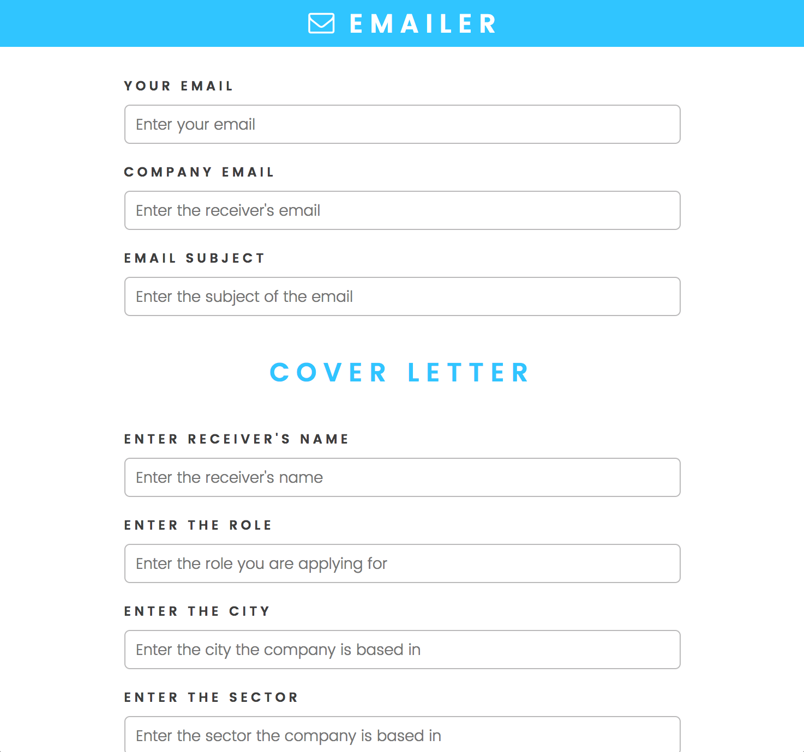

# Emailer

**const createdBy = [[vm.sam](https://github.com/Domesjo), [vm.emily](https://github.com/eisacke), [vm.mike](https://github.com/mickyginger)];**

### Intro

To the run the app:

```bash
$ npm i
$ nodemon
```

***Emailer*** is an app created to send out emails without having to write a template by yourself. The idea is to send out many emails quickly.

The app is built with the following stack:

* Express server
* Node-mailer
* ejs
* Oauth2

### Build

It's a Express serving with ejs templates. The user fills a form which creates an email template by passing an object to a function which assigns the form input to right place in the compile function.

It also takes file upload which allows you to upload CVs or images.

The app runs fine on `localhost:3000` but you need to create the following environment variables: `GMAIL_ADDRESS`, `GMAIL_CLIENT_ID` and `GMAIL_CLIENT_SECRET`.

> ***Emailer*** is open source and if anyone comes up with a different solution do not hesitate to contact me as it is a work in progress.

> Currently we are working on getting it usable without having to preset the environment variable and run it online.




