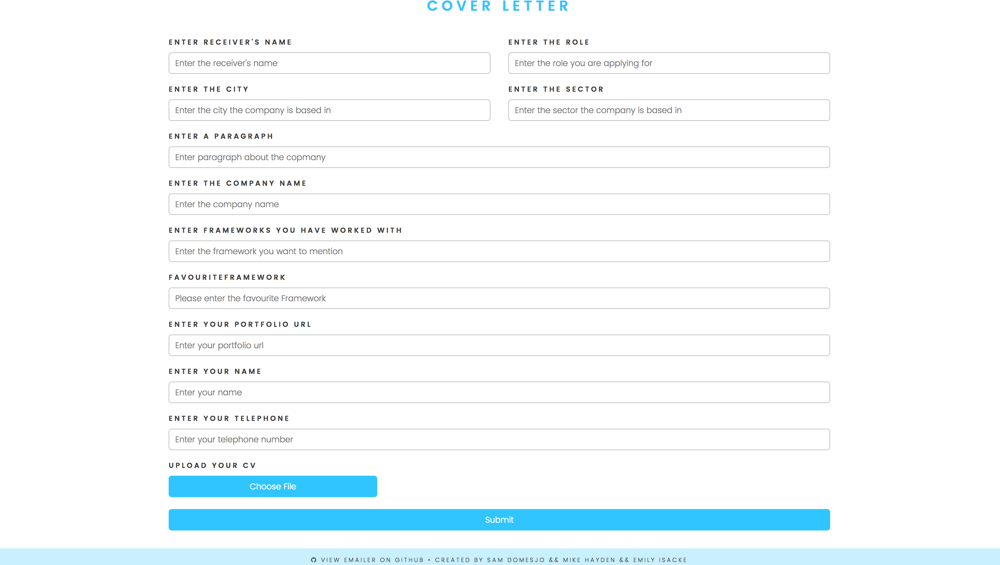
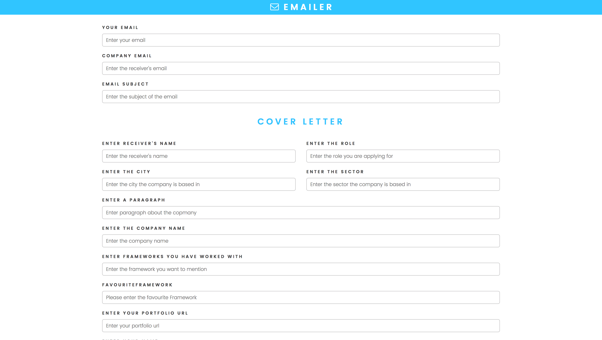
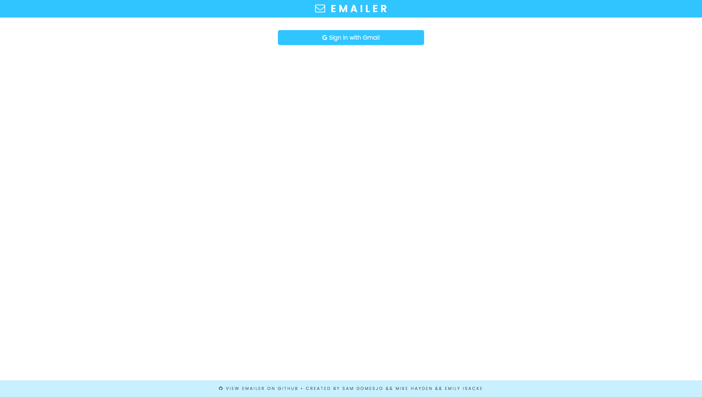

# emailer
#CREATED BY [vm.sam, [vm.emily](https://github.com/eisacke), [vm.mike](https://github.com/mickyginger)];
### Emailer is a app created to send out emails without having to write a template by yourself, The Idea is to send out many emails quick.
### The stack is an express server with Node-mailer, ejs and Oauth2.

## Build
#### It's a express serving with ejs templates. So the User fills a form which creates an email template   by passing an object to a function which assigns the form input to right place in the compile function.
#### It also takes file upload which allows you to upload CVs or images.

### The app runs fine on localhost but you need to attach in the process.env a GMAIL_ADDRESS, GMAIL_CLIENT_ID && GMAIL_CLIENT_SECRET.

### Emailer is open source and if anyone comes up with a different solution do not hesitate to contact me as it is a work in progress.
### currently we are working on getting it usable without having to preset the environment variable and run it online

